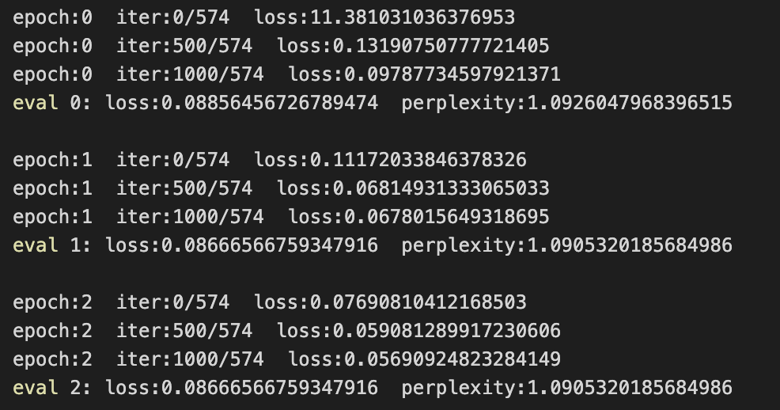

# Pretraining BERT Model
## 專案說明

* 使用台灣繁體中文資料集訓練https://huggingface.co/datasets/yentinglin/zh_TW_c4
* 使用多GPU並行訓練方法
* 使用Mask Language Model 預訓練BERT模型

## Datasets
* `datasets/train.txt`：訓練用文本，可於write_data.ipynb做生成。
* `datasets/dev.txt`：每個訓練epoch結束後，會用dev.txt做驗證。
* `datasets/test.txt`：測試用資料。

## Environment
* python的版本為: 3.10.11
```
torch==1.13.1
transformers==4.29.2
```
* 會需要用到NVIDIA/apex，得將apex git clone再安裝才行。
```
$ git clone https://github.com/NVIDIA/apex
$ cd apex
$ python setup.py install
```
## Get Start

### 單卡模式(測試)

修改`Config.py`文件中的`self.mode='test'`，再運行
```
python main.py
```

### 多卡模式（訓練）
如果你足夠幸運，擁有了多張GPU卡，那麼恭喜你，你可以進入起飛模式。🚀🚀

修改`Config.py`文件中的`self.mode='train'`，再運行
```
python -m torch.distributed.launch --nproc_per_node=4 --master_port='29301' --use_env main.py
```

** 使用torch的`nn.parallel.DistributedDataParallel`模塊進行多卡訓練。

* <font color=#009393>`master_port`：master節點的port號，在不同的節點上master_addr和master_port的設置是一樣的，用來進行通信，port我設置'29301'。</font>
* <font color=#009393>`nproc_per_node`：一個節點中顯卡的數量，我有4片GPU，所以設置4。 </font>

## training
使用交叉熵（cross-entropy）作為損失函數，困惑度（perplexity）和Loss作為評價指標來進行訓練，訓練過程如下：
<!--  -->


## test
結果保存在`dataset/output/pred_data.csv`，分別包含三列：
- `src`表示原始輸入
- `pred`表示模型預測
- `mask`表示模型輸入（帶有mask和pad等token）

## 範例

```
src:  [CLS] art education and first professional work [SEP]
pred: [CLS] art education and first class work [SEP]
mask: [CLS] art education and first [MASK] work [SEP] [PAD] [PAD] [PAD] ...
```


# Reference

【Bert】[https://arxiv.org/pdf/1810.04805.pdf](https://arxiv.org/pdf/1810.04805.pdf)

【transformers】[https://github.com/huggingface/transformers](https://github.com/huggingface/transformers)

【datasets】[https://huggingface.co/docs/datasets/quicktour.html](https://huggingface.co/docs/datasets/quicktour.html)


