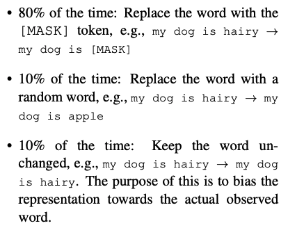
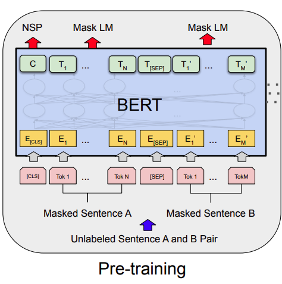

# Pretrain_Bert_with_MaskLM

## Info
使用Mask LM預訓練任務來預訓練Bert模型。

基於pytorch框架，訓練關於垂直領域語料的預訓練語言模型，目的是提升下游任務的表現。


## Pretraining Task
Mask Language Model，簡稱Mask LM，即基於Mask機制的預訓練語言模型。

同時支持 原生的`MaskLM`任務和`Whole Words Masking`任務。默認使用`Whole Words Masking`。

#### MaskLM
使用來自於Bert的mask機制，即對於每一個句子中的詞（token）：
* 85%的概率，保留原詞不變
* 15%的概率，使用以下方式替換
    * 80%的概率，使用字符`[MASK]`，替換當前token。
    * 10%的概率，使用詞表隨機抽取的token，替換當前token。
    * 10%的概率，保留原詞不變。
    <!-- *  -->
    * 

#### Whole Words Masking
與MaskLM類似，但是在mask的步驟有些少不同。

在Bert類模型中，考慮到如果單獨使用整個詞作為詞表的話，那詞表就太大了。不利於模型對同類詞的不同變種的特徵學習，故採用了WordPiece的方式進行分詞。

`Whole Words Masking`的方法在於，在進行mask操作時，對像變為分詞前的整個詞，而非子詞。


## Model
使用原生的Bert模型作為基準模型。
* 


## Datasets
項目裡的數據集來自`wikitext`，分成兩個文件訓練集（train.txt）和測試集（test.txt）。

數據以行為單位存儲。

若想要替換成自己的數據集，可以使用自己的數據集進行替換。 （注意：如果是預訓練中文模型，需要修改配置文件`Config.py`中的`self.initial_pretrain_model`和`self.initial_pretrain_tokenizer`，將值修改成 `bert-base-chinese`）

自己的數據集不需要做mask機制處理，代碼會處理。


## Training Target
本項目目的在於基於現有的預訓練模型參數，如google開源的`bert-base-uncased`、`bert-base-chinese`等，在垂直領域的數據語料上，再次進行預訓練任務，由此提升bert的模型表徵能力，換句話說，也就是提升下游任務的表現。


## Environment

項目主要使用了Huggingface的`datasets`、`transformers`模塊，支持CPU、單卡單機、單機多卡三種模式。

python的版本為: 3.8

可通過以下命令安裝依賴包
```
    pip install -r requirement.txt
```
主要包含的模塊如下：
```
    numpy==1.24.1
    pandas==1.5.2
    scikit_learn==1.2.1
    torch==1.8.0
    tqdm==4.64.1
    transformers==4.26.1
```


## Get Start

### 單卡模式
(1) 訓練

直接運行
```
    python main.py
```

(2) 測試

修改`Config.py`文件中的`self.mode='test'`，再運行
```
    python main.py
```

### 多卡模式（訓練）
如果你足夠幸運，擁有了多張GPU卡，那麼恭喜你，你可以進入起飛模式。🚀🚀

（1）使用torch的`nn.parallel.DistributedDataParallel`模塊進行多卡訓練。其中`config.py`文件中參數如下，默認可以不用修改。

* <font color=#009393>`self.cuda_visible_devices`表示程序可見的GPU卡號，示例：`1,2`→可在GPU卡號為1和2上跑，亦可以改多張，如`0,1,2,3`。</font>
* <font color=#009393>`self.device`在單卡模式，表示程序運行的卡號；在多卡模式下，表示master的主卡，默認會變成你指定卡號的第一張卡。若只有cpu，那麼可修改為`cpu`。</font>
* <font color=#009393>`self.port`表示多卡模式下，進程通信佔用的端口號。 （無需修改）</font>
* <font color=#009393>`self.init_method`表示多卡模式下進程的通訊地址。 （無需修改）</font>
* <font color=#009393>`self.world_size`表示啟動的進程數量（無需修改）。在torch==1.3.0版本下，只需指定一個進程。在1.9.0以上，需要與GPU數量相同。</font>

# Experiment

## training
使用交叉熵（cross-entropy）作為損失函數，困惑度（perplexity）和Loss作為評價指標來進行訓練，訓練過程如下：
<!--  -->


## test
結果保存在`dataset/output/pred_data.csv`，分別包含三列：
- `src`表示原始輸入
- `pred`表示模型預測
- `mask`表示模型輸入（帶有mask和pad等token）

示例

```
src:  [CLS] art education and first professional work [SEP]
pred: [CLS] art education and first class work [SEP]
mask: [CLS] art education and first [MASK] work [SEP] [PAD] [PAD] [PAD] ...
```


# Reference

【Bert】[https://arxiv.org/pdf/1810.04805.pdf](https://arxiv.org/pdf/1810.04805.pdf)

【transformers】[https://github.com/huggingface/transformers](https://github.com/huggingface/transformers)

【datasets】[https://huggingface.co/docs/datasets/quicktour.html](https://huggingface.co/docs/datasets/quicktour.html)


